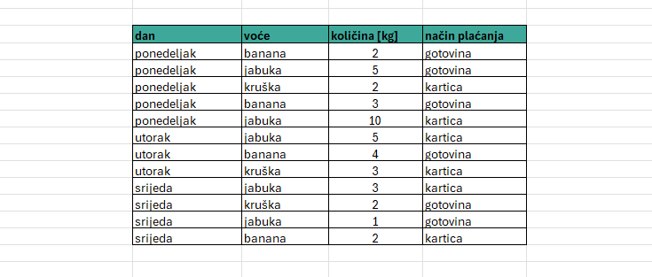
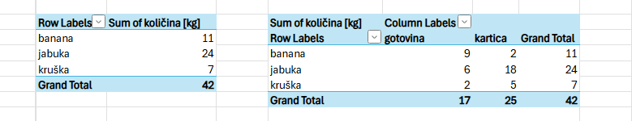

# Pivot tablice

Pivot tablica je jedan od najvažnijih alata za analizu podataka u programima kao što su *Microsoft Excel* i *Google Sheets*. Ona omogućuje da iste podatke "okrenemo" (pivot = okrenuti) i organiziramo iz različitih kutova, ovisno o tome što želimo saznati.

```{infonote}
U košarci, pivot je igrač koji jednom nogom ostaje na mjestu, a okretanjem tijela može dodati loptu u različitim smjerovima. Slično tome, zaokretna tablica koristi iste podatke, ali ih "okreće" i reorganizira tako da ih možemo promatrati iz različitih kutova, ovisno o tome što želimo naučiti.
```
Radnica u prodavaonici voća svakoga dana bilježi svaku prodaju u tablicu. Za svaku kupnju zabilježila je sljedeće podatke:



Ovo su sirovi podaci. Iz njih ne možemo odmah dobiti odgovor na pitanja poput *Koje se voće najviše prodaje?* ili *Plaćaju li kupci češće gotovinom ili karticom?*

## Razlika između obične i pivot tablice

U običnoj tablici možemo vidjeti svaku pojedinačnu prodaju, ali ako želimo saznati, na primjer, ukupnu količinu prodanog voća svake vrste, morali bismo ručno pronaći sve retke s jabukama i zbrojiti količine, zatim banane, pa narandže... Kod većeg broja redaka to traje i lako se pogriješiti.

**Zaokretna tablica automatski organizira i zbraja podatke.** Na primjer:



Ovakav prikaz omogućuje da odmah vidimo rezultate, bez ručnog zbrajanja i bez formula.

```{infonote}
Obična tablica prikazuje pojedinačne podatke. Zaokretna tablica prikazuje njihov pregled i omogućuje analizu.
```
